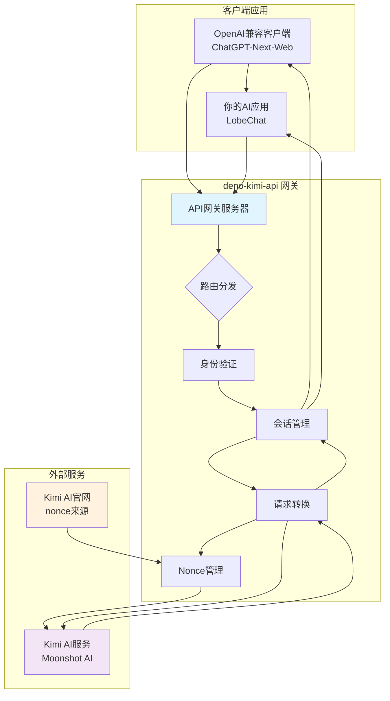
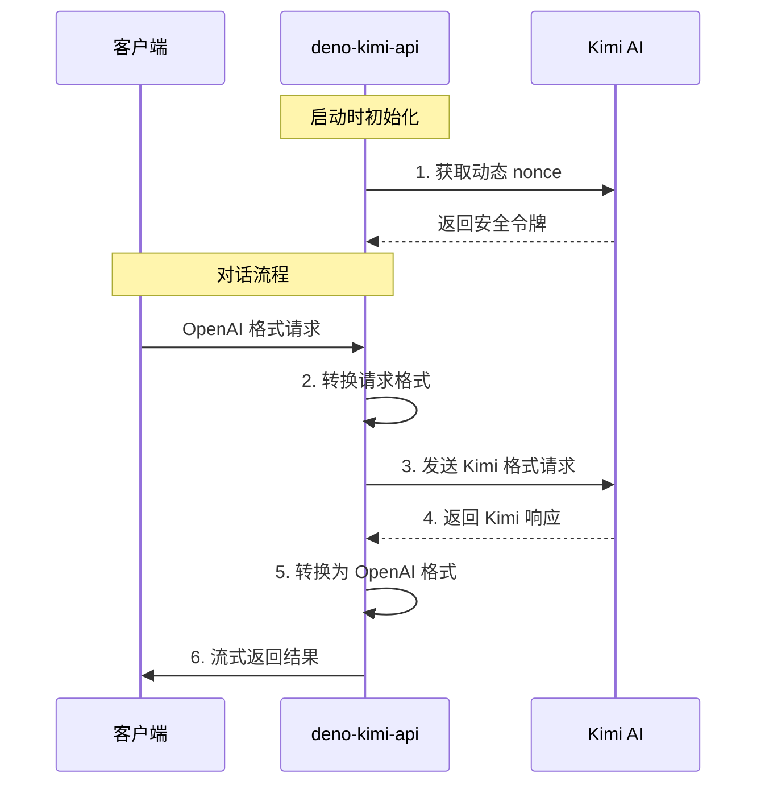

# 🚀 deno-kimi-api

> **你的 Kimi AI 私人助理网关 | 开源、高性能、OpenAI 兼容**

[](https://opensource.org/licenses/Apache-2.0)
[](https://deno.land)
[](https://github.com/lzA6/deno-kimi-api)
[](https://github.com/ellerbrock/open-source-badges/)

> **"我们站在巨人的肩膀上，不是为了看得更远，而是为了能与巨人并肩，一同探索星辰大海。这个项目，就是你通往 Kimi AI 这个巨人的私人桥梁。"**

欢迎来到 `deno-kimi-api` 的世界！这是一个将强大的 [Kimi AI](https://kimi.ai) 聊天服务转换为完全兼容 **OpenAI API 格式** 接口的神奇项目。

这意味着，你可以用海量的、为 OpenAI 生态打造的工具、应用和代码库，无缝对接 Kimi 的**超长上下文处理能力**！

---

## ✨ 核心特性

### 🚀 性能优异
基于 Deno 和 Rust 技术栈，性能远超传统的 Python 脚本，启动速度快，内存占用低。

### 🛡️ 安全可靠
Deno 的默认安全模型让你清楚地知道脚本需要什么权限 (`--allow-net`, `--allow-env`)。

### 🔄 OpenAI 完全兼容
完美模拟 `/v1/chat/completions` 和 `/v1/models` 接口，支持流式响应，让你的现有应用无缝迁移。

### 💬 有状态对话
支持多用户会话管理，为不同用户维持独立的对话上下文，实现真正的连续对话体验。

---

## 🎯 它能做什么？

### 📚 个人知识库问答
将你的长篇文档、小说、代码库喂给 Kimi，然后通过任何 OpenAI 客户端进行深度提问和分析。

### 🔧 开发集成
在你自己的应用程序中，用熟悉的 OpenAI SDK 直接调用 Kimi 的强大能力，无需学习新的 API。

### 🎓 学术研究
处理大量文本、论文、资料的研究者，可以利用此工具快速搭建强大的长文本分析助手。

### 🧪 学习探索
对 API 代理、Deno 开发、Web 技术感兴趣的同学，这是一个麻雀虽小五脏俱全的实战项目。

---

## 🏗️ 系统架构



---

## ⚡ 快速开始

### 第 1 步：安装 Deno

**macOS / Linux:**
```bash
curl -fsSL https://deno.land/x/install/install.sh | sh
```

**Windows (PowerShell):**
```powershell
irm https://deno.land/x/install/install.ps1 | iex
```

### 第 2 步：获取项目
```bash
git clone https://github.com/lzA6/deno-kimi-api.git
cd deno-kimi-api
```

### 第 3 步：配置环境
创建 `.env` 文件：
```env
# 安全配置 - 强烈建议修改！
API_MASTER_KEY=sk-your-secret-key-123456

# 服务配置
PORT=8088

# 会话管理
SESSION_CACHE_TTL=3600
```

### 第 4 步：启动服务
```bash
deno run --allow-net --allow-env --allow-read main.ts
```

看到以下输出即表示成功：
```
🚀 deno-kimi-api v1.0.0 启动中...
🔧 正在初始化 KimiAIProvider...
📡 成功抓取到新的 nonce: xxxxxxxxx
✅ 服务已启动，正在监听 http://localhost:8088
```

### 第 5 步：配置客户端
在任何支持 OpenAI API 的客户端中配置：

- **API 地址**: `http://localhost:8088/v1`
- **API 密钥**: 你在 `.env` 中设置的 `API_MASTER_KEY`
- **模型**: `kimi-k2-instruct-0905` 或 `kimi-k2-instruct`

---

## 🔧 技术详解

### 核心工作原理



### 关键技术特性

| 技术组件 | 重要性 | 说明 | 改进方向 |
|---------|--------|------|----------|
| **Deno 运行时** | ⭐⭐⭐⭐⭐ | 安全、现代的 TypeScript 运行时，无需复杂依赖 | 生态持续完善中 |
| **Nonce 管理** | ⭐⭐⭐⭐☆ | 动态获取安全令牌，支持失败重试 | 探索更稳定的获取方式 |
| **会话缓存** | ⭐⭐⭐☆☆ | 内存级会话管理，支持 TTL 过期 | 支持 Redis 持久化 |
| **流式响应** | ⭐⭐⭐⭐☆ | 模拟 OpenAI SSE 格式，逐字输出体验 | 实现真·流式传输 |
| **请求转换** | ⭐⭐⭐⭐⭐ | 完整的 API 格式转换引擎 | 支持更多端点 |

---

## 📁 项目结构

```
deno-kimi-api/
├── 📄 main.ts                 # 项目核心入口文件
├── 📄 .env                    # 环境配置文件
├── 📄 deno.json               # Deno 配置文件
├── 📄 README.md               # 项目说明文档
└── 📁 types/                  # TypeScript 类型定义
    └── 📄 openai.ts           # OpenAI 兼容类型
```

---

## 🗺️ 开发路线图

### ✅ 已完成功能
- [x] **核心代理功能** - OpenAI 到 Kimi 的完整转换
- [x] **流式响应模拟** - 兼容 OpenAI SSE 格式
- [x] **多用户会话** - 基于内存的上下文管理
- [x] **安全验证** - API 密钥保护机制
- [x] **模型列表** - 模拟 `/v1/models` 端点

### 🔄 进行中改进
- [ ] **Nonce 稳定性** - 探索更可靠的获取方式
- [ ] **错误处理** - 更精细的上游错误传递
- [ ] **性能优化** - 请求处理和缓存机制

### 🚀 未来规划
- [ ] **真·流式传输** - 实现低延迟实时响应
- [ ] **持久化会话** - Redis/SQLite 支持
- [ ] **Docker 化** - 容器化部署方案
- [ ] **Web UI** - 管理界面和测试工具
- [ ] **多账号负载均衡** - 突破速率限制

---

## 🤝 贡献指南

我们相信开源的力量！每一行代码，每一次思考，都在为这个世界增添美好。

**如何参与贡献：**

1. **报告问题** - 在 GitHub Issues 中反馈 bug 或建议
2. **功能开发** - 认领开发任务，提交 Pull Request
3. **文档改进** - 完善文档，帮助更多用户
4. **测试验证** - 测试新功能，确保稳定性

**开发环境设置：**
```bash
# 克隆项目
git clone https://github.com/lzA6/deno-kimi-api.git
cd deno-kimi-api

# 安装依赖（如有）
deno cache main.ts

# 运行测试
deno test --allow-net --allow-env
```

---

## 📜 开源协议

本项目采用 **Apache 2.0 开源协议** - 你可以在遵守协议要求的前提下自由使用、修改和分发。

[查看完整协议内容](https://opensource.org/licenses/Apache-2.0)

---

## 💡 使用建议

### 🎨 推荐客户端
- **[NextChat](https://github.com/ChatGPTNextWeb/ChatGPT-Next-Web)** - 功能丰富的 Web 客户端
- **[LobeChat](https://github.com/lobehub/lobe-chat)** - 现代化的聊天界面
- **[OpenCat](https://opencat.app)** - 优雅的桌面客户端

### 🔒 安全提示
- 定期更新 `API_MASTER_KEY`
- 不要在公网暴露服务端口
- 监控服务日志，及时发现异常

### 🚀 性能调优
- 调整 `SESSION_CACHE_TTL` 优化内存使用
- 考虑使用进程管理器（如 pm2）管理服务
- 监控 nonce 获取频率，避免被限制

---

## ❓ 常见问题

**Q: 为什么需要获取 nonce？**
A: nonce 是 Kimi 服务的安全令牌，每次对话都需要有效的 nonce 进行身份验证。

**Q: 服务重启后对话历史会丢失吗？**
A: 是的，当前版本使用内存存储，重启后历史丢失。持久化版本正在开发中。

**Q: 支持真正的流式响应吗？**
A: 当前是模拟流式，完整响应后逐字输出。真正的流式传输是未来开发重点。

**Q: 如何查看详细的运行日志？**
A: 启动时添加 `--log-level=DEBUG` 参数查看详细日志信息。

---

## 📞 技术支持

- 📧 **问题反馈**: [GitHub Issues](https://github.com/lzA6/deno-kimi-api/issues)
- 💬 **技术讨论**: [GitHub Discussions](https://github.com/lzA6/deno-kimi-api/discussions)
- 🐛 **Bug 报告**: 通过 Issue 模板提交

---

<div align="center">

**如果这个项目对你有帮助，请给个 ⭐ Star 支持我们！**

*让更多开发者能够享受到开源技术带来的便利*

</div>
```
